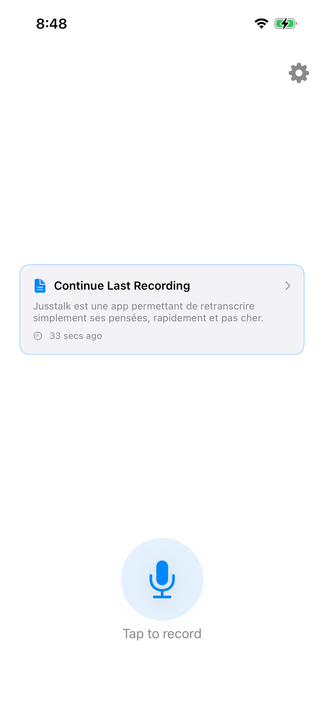
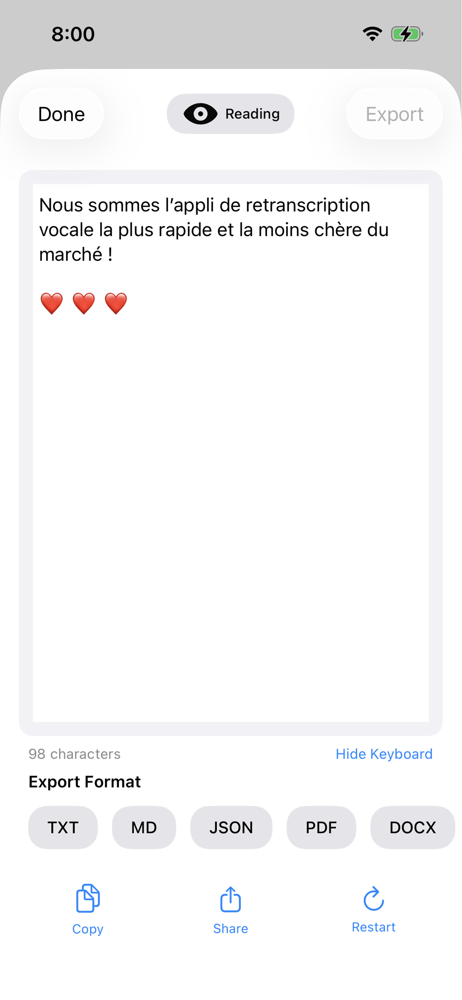
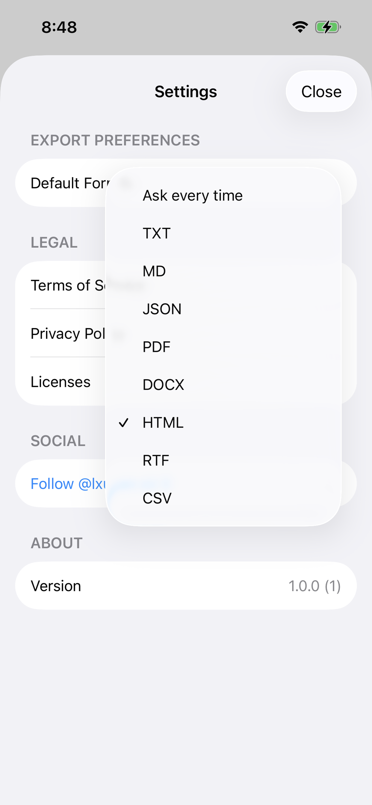

# Jusstalk

Turn your voice into text instantly.

---

## About

Jusstalk is a native iOS app that transforms your voice recordings into accurate text transcriptions using advanced AI. Whether you're capturing meeting notes, ideas, or memos, Jusstalk makes it effortless.

### Key Features

- **One-Tap Recording** — Simply tap to record, tap to stop
- **AI-Powered Transcription** — Powered by Mistral AI's Voxtral-Mini-Transcribe-2507
- **Smart Editing** — Review and edit your transcriptions with built-in tools
- **Multiple Export Formats** — TXT, MD, JSON, PDF, HTML, CSV, and more
- **AI Formatting** — Auto-formats your text into structured documents
- **Privacy First** — Your audio is processed securely and deleted immediately

---

## Screenshots

| | | | |
|:---:|:---:|:---:|:---:|
|  |  |  |  |
| Record | Edit | Export | Download |

---

## Technical Details

- **Platform**: iOS 15.0+
- **Framework**: SwiftUI
- **APIs**: Mistral AI (Voxtral), DeepSeek
- **Architecture**: MVVM

---

## Support

### Frequently Asked Questions

#### Getting Started

**How do I record?**
Tap the microphone button to start, tap again to stop. Your transcription will appear automatically.

**What languages are supported?**
Voxtral-Mini primarily supports English and major languages. Speak clearly for best results.

#### Transcription

**How accurate is it?**
Accuracy depends on audio quality, speaker clarity, and background noise. You can always edit the result.

**Can I edit my transcription?**
Yes. Toggle to "Edit" mode using the button in the toolbar.

#### Export

**What formats are available?**
- TXT — Plain text
- MD — Markdown with formatting
- JSON — Structured data with summary and topics
- PDF — Document
- HTML — Web page
- CSV — Spreadsheet
- RTF — Rich text

**How do I set a default format?**
Go to Settings > Default Format in the app.

#### Privacy

**Where is my data stored?**
Audio is temporarily processed through Mistral AI and deleted immediately. Text can be saved locally on your device.

**Is my audio sent to servers?**
Only to Mistral AI for transcription, and it's deleted right after.

#### Troubleshooting

**Microphone access denied**
Go to Settings > Privacy > Microphone on your device and enable Jusstalk.

**Transcription fails**
- Check your internet connection
- Try again (automatic retry included)
- Ensure audio is clear

---

## Legal

### Terms of Service
By using Jusstalk, you agree to our terms. You retain rights to your transcriptions. The Voxtral model is licensed under Apache 2.0.

### Privacy Policy
- Audio processed via Mistral AI, deleted after transcription
- No personal data collected
- No data shared with third parties
- Settings stored locally only

### Licenses
- Voxtral-Mini-Transcribe-2507: Apache 2.0 (Mistral AI)
- Swift & SwiftUI: Apache 2.0 (Apple)

---

## Contact

- **Twitter**: @lxucan

---

*Jusstalk — Transform your voice into text*
